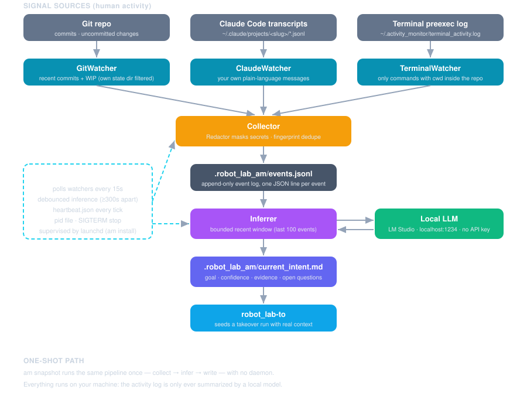

# robot_lab-am

**A standalone repo activity monitor** — a background daemon that watches what
*you* are doing in a repo (git activity, Claude Code sessions, terminal
commands) and distills it into a current-goal statement via a one-shot
[RubyLLM](https://rubyllm.com) call to a local model. Any tool can read the
intent artifact it writes; [`robot_lab-to`](https://madbomber.github.io/robot_lab-to/)
uses it to seed a takeover run, but nothing here depends on the RobotLab
framework.

The original point: when you say "take over," the robot should start from
*what you were actually doing* — not from a cold objective string you typed
at invocation time.



## What it produces

Every inference writes `.robot_lab_am/current_intent.md` in the watched repo —
YAML front matter plus a prose goal statement:

```markdown
---
confidence: high
generated_at: '2026-09-01T23:22:56Z'
evidence:
- Commit d8b2f5f touches the daemon start/stop lifecycle
- Terminal shows repeated `asgard quality` runs
open_questions:
- Whether the launchd agent should auto-load after install
---

Completing the robot_lab-am daemon implementation: start/stop/status
lifecycle, heartbeat, and launchd supervision, driven toward green
quality gates.
```

`robot_lab-to` reads this file the way it already reads `notes.md` — as the
seed objective when none is given, or as extra context alongside one.

## Design commitments

- **Local-first inference.** Your activity log — commits, commands, your own
  Claude Code messages — never leaves the machine. Inference defaults to a
  local model served by LM Studio's OpenAI-compatible API; no hosted provider,
  no API key. See [Privacy & Redaction](privacy.md).
- **One repo per daemon.** Each daemon instance watches exactly one repo root.
  Watching several repos means running several instances.
- **Read-side opt-in.** The terminal log spans every shell on the machine, but
  the daemon only ever parses lines whose `cwd` falls inside the watched repo.
- **Redaction before storage.** Credential-shaped values are masked before an
  event is written to disk or shown to the LLM.

## The 60-second version

```bash
gem install robot_lab-am

cd ~/src/my_project
am snapshot        # one-shot: collect activity, infer, write current_intent.md
am start           # or: run the daemon continuously
am status
```

Continue with [Getting Started](getting-started.md).

## Part of the RobotLab family

| Gem | Role |
|-----|------|
| [`robot_lab`](https://github.com/MadBomber/robot_lab) | Core framework: robots, networks, MCP, memory |
| **`robot_lab-am`** | Senses *human* activity outside any run and turns it into tasking context |
| [`robot_lab-to`](https://github.com/MadBomber/robot_lab-to) | The consumer — autonomous "takeover" loop seeded by the inferred intent |
| [`robot_lab-audit`](https://github.com/MadBomber/robot_lab-audit) | The structural sibling — logs *robot* activity, where this gem logs yours |
